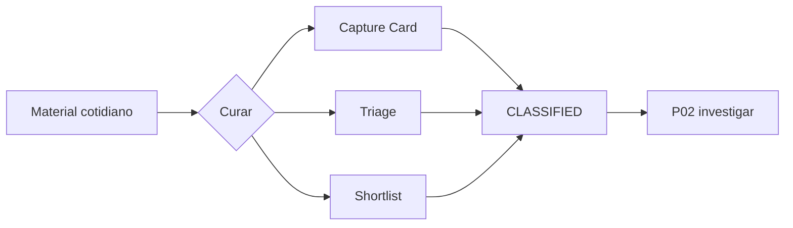

# Convierte tu día a día en oportunidades de contenido · P01

> Provenance: `MIA-MEDIA-LIB-2.0.0` v2.0.0-candidato · Estado: candidate · captura · triage · ideas · privacidad [DOC]

## Outputs

- Material cotidiano clasificado en oportunidades trazables
- Captura mínima propuesta sin obligar a publicar
- Shortlist digerible priorizada

## Deliverables

- `capture-card-v1`
- `triage-record-v1`
- `digest-shortlist-v1`

## Schematic



## ES — SPEC verbatim

```text
SITUACIÓN
El creador posee material orgánico imperfecto —ideas, audios, imágenes, videos, experiencias o conversaciones—, pero todavía no sabe qué merece convertirse en contenido. Documentar no equivale a publicar.

PEDIDO
Selecciona una sola modalidad:
1. Captura: registrar una entrada.
2. Triage: decidir su destino.
3. Digest: curar un lote.
4. Recuperación: encontrar material previo pertinente.
Devuelve un artefacto trazable que preserve procedencia, privacidad y posibilidad de reutilización.

EJECUCIÓN
1. Declara qué archivos o fragmentos pudiste leer, escuchar o ver.
2. Asocia todo al mismo creador y conserva el origen.
3. Extrae por entrada:
   - momento y contexto;
   - persona, objeto o lugar;
   - tensión, pregunta o sorpresa;
   - decisión o cambio;
   - frase natural;
   - evidencia disponible;
   - aprendizaje provisional;
   - imagen, gesto, textura o sonido;
   - audiencia que podría valorarlo;
   - permiso, privacidad o sensibilidad.
4. Aplica la modalidad:
   - Captura: crea una tarjeta sin exigir una historia terminada.
   - Triage: clasifica producir, acumular, investigar, proteger o descartar.
   - Digest: agrupa temas, elimina duplicados, detecta series y selecciona máximo tres prioridades.
   - Recuperación: devuelve una shortlist con versión, procedencia, derechos y uso permitido.
   - Si el objetivo es reutilización audiovisual, conserva exactamente cinco momentos candidatos respaldados por fuente. Liga el conjunto a un `opportunity-source-receipt-v1` vigente, calculado sobre bytes, duración, cuadros y fps coherentes. Clasifícalos como demostración, antes/después, testimonio, microtutorial, prueba de capacidad, proceso o portafolio, sin decidir todavía formato ni producción.
5. Evalúa especificidad, punto de vista, valor, evidencia, esfuerzo, exposición y coherencia con el Brand OS cuando exista.
6. Separa Observado, Inferido, Supuesto y Dato requerido.
7. Recomienda qué registrar después: máximo tres momentos, tres imágenes/planos, un sonido, una frase, una evidencia y un permiso.
8. Termina con la decisión y una acción de menos de quince minutos.

LÍMITES Y CASOS BORDE
- No conviertas dolor, intimidad o información de terceros en contenido por defecto.
- No inventes contexto para un archivo incompleto.
- No recuperes activos de otro creador ni material protegido, retirado o sin permiso.
- Si hay varias historias, sepáralas antes del brief.
- Si la entrada no tiene valor público, puede conservar valor privado.
- Si el volumen es bajo, no simules un digest: entrega la mejor tarjeta disponible.
- Si no existen cinco momentos audiovisuales acreditables o el receipt está vencido, declara el gap y no completes el conjunto por inferencia.

CRITERIO
PASS cuando:
- toda oportunidad conserva su fuente;
- la decisión de triage es explícita y reversible;
- máximo tres prioridades compiten por capacidad;
- los elementos sensibles están marcados;
- no se fabricó una historia;
- existe una captura o siguiente acción concreta.
- la reutilización audiovisual conserva cinco momentos candidatos ligados a fuente o queda bloqueada con evidencia faltante explícita.

DEFINITION OF DONE
Capture Card, Triage Record o Digest/Shortlist, con base de evidencia, sensibilidad, estado y siguiente acción.

FALLBACK
Cuando el material sea insuficiente, acumúlalo y propone la captura mínima que permitiría evaluarlo; cuando exista riesgo, protege antes de producir. interpreta, planifica, ejecuta.
```

## EN — SPEC verbatim

```text
SITUATION
The creator has imperfect organic material—ideas, audio, images, video, experiences, or conversations—but does not yet know what deserves to become content. Documenting does not equal publishing.

REQUEST
Select one mode only:
1. Capture: register one entry.
2. Triage: decide its destination.
3. Digest: curate a batch.
4. Retrieval: find relevant prior material.
Return a traceable artifact that preserves provenance, privacy, and reuse potential.

EXECUTION
1. State which files or fragments you could read, hear, or see.
2. Associate everything with the same creator and preserve the source.
3. Extract for each entry:
   - moment and context;
   - person, object, or place;
   - tension, question, or surprise;
   - decision or change;
   - natural phrase;
   - available evidence;
   - provisional learning;
   - image, gesture, texture, or sound;
   - audience that could value it;
   - permission, privacy, or sensitivity.
4. Apply the selected mode:
   - Capture: create a card without requiring a finished story.
   - Triage: classify as produce, accumulate, research, protect, or discard.
   - Digest: group topics, remove duplicates, detect series, and select no more than three priorities.
   - Retrieval: return a shortlist with version, provenance, rights, and permitted use.
   - For audiovisual reuse, preserve exactly five source-backed candidate moments. Bind the set to a current `opportunity-source-receipt-v1` calculated from bytes and coherent duration, frames, and fps. Classify them as demonstration, before/after, testimonial, microtutorial, capability proof, process, or portfolio without choosing a format or production path yet.
5. Evaluate specificity, point of view, value, evidence, effort, exposure, and coherence with the Brand OS when available.
6. Separate Observed, Inferred, Assumed, and Required data.
7. Recommend what to document next: no more than three moments, three images/shots, one sound, one phrase, one item of evidence, and one permission.
8. Finish with the decision and one action of under fifteen minutes.

LIMITS AND EDGE CASES
- Do not turn pain, intimacy, or third-party information into content by default.
- Do not invent context for an incomplete file.
- Do not retrieve assets from another creator or material that is protected, withdrawn, or unauthorized.
- If several stories exist, separate them before the brief.
- If the entry has no public value, it may retain private value.
- If volume is low, do not simulate a digest: deliver the best available card.
- If five audiovisual moments cannot be evidenced or the receipt is stale, declare the gap and do not complete the set by inference.

CRITERIA
PASS when:
- every opportunity preserves its source;
- the triage decision is explicit and reversible;
- no more than three priorities compete for capacity;
- sensitive elements are marked;
- no story was fabricated;
- a concrete capture or next action exists.
- audiovisual reuse preserves five source-bound candidate moments or remains blocked with explicit missing evidence.

DEFINITION OF DONE
Capture Card, Triage Record, or Digest/Shortlist, with evidence basis, sensitivity, state, and next action.

FALLBACK
When material is insufficient, accumulate it and propose the minimum capture needed to evaluate it; when risk exists, protect before producing. interpret, plan, execute.
```

## PT — SPEC verbatim

```text
SITUAÇÃO
O criador possui material orgânico imperfeito — ideias, áudios, imagens, vídeos, experiências ou conversas —, mas ainda não sabe o que merece se tornar conteúdo. Documentar não equivale a publicar.

PEDIDO
Selecione uma única modalidade:
1. Captura: registrar uma entrada.
2. Triagem: decidir seu destino.
3. Digest: curar um lote.
4. Recuperação: encontrar material anterior pertinente.
Devolva um artefato rastreável que preserve procedência, privacidade e possibilidade de reutilização.

EXECUÇÃO
1. Declare quais arquivos ou fragmentos você conseguiu ler, ouvir ou ver.
2. Associe tudo ao mesmo criador e preserve a origem.
3. Extraia por entrada:
   - momento e contexto;
   - pessoa, objeto ou lugar;
   - tensão, pergunta ou surpresa;
   - decisão ou mudança;
   - frase natural;
   - evidência disponível;
   - aprendizado provisório;
   - imagem, gesto, textura ou som;
   - audiência que poderia valorizá-lo;
   - permissão, privacidade ou sensibilidade.
4. Aplique a modalidade:
   - Captura: crie um cartão sem exigir uma história concluída.
   - Triagem: classifique como produzir, acumular, pesquisar, proteger ou descartar.
   - Digest: agrupe temas, remova duplicados, detecte séries e selecione no máximo três prioridades.
   - Recuperação: devolva uma shortlist com versão, procedência, direitos e uso permitido.
   - Para reutilização audiovisual, preserve exatamente cinco momentos candidatos sustentados pela fonte. Vincule o conjunto a um `opportunity-source-receipt-v1` vigente, calculado sobre bytes, duração, quadros e fps coerentes. Classifique-os como demonstração, antes/depois, depoimento, microtutorial, prova de capacidade, processo ou portfólio, sem escolher ainda formato nem produção.
5. Avalie especificidade, ponto de vista, valor, evidência, esforço, exposição e coerência com o Brand OS quando houver.
6. Separe Observado, Inferido, Suposição e Dado requerido.
7. Recomende o que registrar depois: no máximo três momentos, três imagens/planos, um som, uma frase, uma evidência e uma permissão.
8. Termine com a decisão e uma ação de menos de quinze minutos.

LIMITES E CASOS LIMITE
- Não transforme dor, intimidade ou informação de terceiros em conteúdo por padrão.
- Não invente contexto para um arquivo incompleto.
- Não recupere ativos de outro criador nem material protegido, retirado ou sem permissão.
- Se houver várias histórias, separe-as antes do brief.
- Se a entrada não tiver valor público, ainda pode ter valor privado.
- Se o volume for baixo, não simule um digest: entregue o melhor cartão disponível.
- Se não houver cinco momentos audiovisuais comprováveis ou o receipt estiver vencido, declare o gap e não complete o conjunto por inferência.

CRITÉRIO
PASS quando:
- toda oportunidade preserva sua fonte;
- a decisão de triagem é explícita e reversível;
- no máximo três prioridades competem pela capacidade;
- os elementos sensíveis estão marcados;
- nenhuma história foi fabricada;
- existe uma captura ou próxima ação concreta.
- a reutilização audiovisual preserva cinco momentos candidatos vinculados à fonte ou permanece bloqueada com evidência faltante explícita.

DEFINITION OF DONE
Capture Card, Triage Record ou Digest/Shortlist, com base de evidência, sensibilidade, estado e próxima ação.

FALLBACK
Quando o material for insuficiente, acumule-o e proponha a captura mínima que permitiria avaliá-lo; quando houver risco, proteja antes de produzir. interpreta, planeja, executa.
```

## Evidence tuple (O/I/A/R)

Base de evidencia

## Modelo recomendado

Modelo recomendado

## Criterios de aceptación

Criterios de aceptación

## No-regresión

Checklist de no regresión

## Definition of Done

Definition of Done
