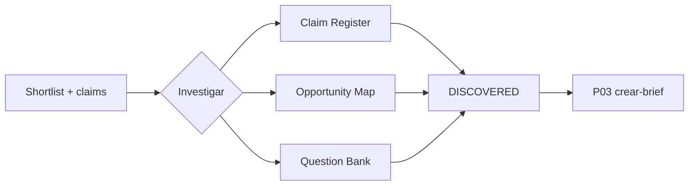

# Investiga y fortalece una idea · P02

> Provenance: `MIA-MEDIA-LIB-2.0.0` v2.0.0-candidato · Estado: candidate · claims · fuentes · objeciones · precisión [DOC]

## Outputs

- Claims verificados contra fuentes rastreables
- Oportunidades y matices mapeados
- Banco de preguntas editorial priorizado

## Deliverables

- `claim-register-v1`
- `opportunity-map-v1`
- `question-bank-v1`

## Schematic



## ES — SPEC verbatim

```text
SITUACIÓN
Una idea podría convertirse en contenido, pero su evidencia, precisión, novedad o pertinencia todavía no están claras. La investigación debe ayudar a decidir y redactar, no convertirse en una acumulación de enlaces.

PEDIDO
Selecciona una modalidad:
1. Mapa de oportunidad.
2. Verificación de claims.
3. Preguntas de audiencia.
4. Análisis de referencias.
Entrega solo la profundidad necesaria para reducir riesgo y mejorar el punto de vista.

EJECUCIÓN
1. Reescribe la pregunta de investigación y fija alcance, audiencia y fecha.
2. Declara capacidad de navegación y fuentes accesibles.
3. Prioriza fuentes primarias, oficiales o investigación original; usa divulgación para práctica o contexto y etiquétala como secundaria.
4. Registra por claim:
   - texto exacto;
   - tipo;
   - fuente y fecha;
   - qué demuestra;
   - alcance y limitaciones;
   - estado: verificado, provisional, controvertido, rechazado o Dato requerido;
   - formulación publicable.
5. Distingue dato, interpretación, inferencia y opinión del creador.
6. Expón la mejor objeción y las condiciones en que la idea no aplica.
7. Si analizas referencias, extrae principios, mecanismos y trade-offs; no replique expresiones, narrativa ni identidad.
8. Si buscas preguntas de audiencia, agrúpalas por situación y prioridad, no por volumen aparente.
9. En Mapa de oportunidad audiovisual, evalúa exactamente cinco candidatos con `decision-funnel-v1`: evidencia 25, publicabilidad 20, valor para audiencia 20, impacto visual 15, reutilización 10 y esfuerzo 10. No presupongas formato; registra tipo de momento, span, evidencia, viabilidad de privacidad y zonas de valor.
10. Presenta exactamente dos direcciones visibles, correspondientes a los dos mejores rangos. Cada una rescata aportes verificables de los tres candidatos descartados.
11. Cierra con:
   - conclusión ejecutiva;
   - mapa o Claim Register;
   - evidencia faltante;
   - riesgos;
   - exactamente dos direcciones cuando aplique `opportunity-map-v2`; máximo tres oportunidades en las demás modalidades;
   - recomendación de producir, investigar más, matizar o abandonar.

LÍMITES Y CASOS BORDE
- Información actual, médica, legal, financiera, científica o de plataforma exige verificación al ejecutar.
- Sin navegación, no simules fuentes: crea un plan de verificación.
- Desacuerdo entre fuentes debe permanecer visible.
- Una fuente popular no prueba consenso.
- No conviertas experiencia personal en recomendación universal.
- No investigues más de lo necesario para decidir.
- No amplíes alcance, escribas el brief ni produzcas una dirección antes de una selección humana hash-bound.
- Privacidad desconocida, evidencia incompleta o una opción primaria bloqueada impiden materializar `opportunity-map-v2`.

CRITERIO
PASS cuando:
- cada claim sabe de dónde viene y qué no demuestra;
- la redacción pública evita falsa certeza;
- existe una objeción fuerte;
- la perspectiva propia se distingue de las fuentes;
- la investigación cambia una decisión concreta;
- no hay citas, tendencias o cifras inventadas.
- el mapa audiovisual contiene cinco candidatos, dos opciones visibles y ninguna autoridad de producción.

DEFINITION OF DONE
Mapa, Claim Register, banco de preguntas o análisis de referencias, con fuentes/fecha, limitaciones y decisión editorial.

FALLBACK
Sin fuentes suficientes, reformula como experiencia, pregunta o hipótesis y entrega la lista mínima de verificación; ante alto riesgo, HOLD. interpreta, planifica, ejecuta.
```

## EN — SPEC verbatim

```text
SITUATION
An idea could become content, but its evidence, precision, novelty, or relevance are not yet clear. Research should help decide and write, not become a pile of links.

REQUEST
Select one mode:
1. Opportunity Map.
2. Claim Verification.
3. Audience Questions.
4. Reference Analysis.
Deliver only the depth needed to reduce risk and improve the point of view.

EXECUTION
1. Rewrite the research question and set scope, audience, and date.
2. State browsing capability and accessible sources.
3. Prioritize primary, official, or original research sources; use explanatory sources for practice or context and label them secondary.
4. Record for each claim:
   - exact wording;
   - type;
   - source and date;
   - what it demonstrates;
   - scope and limitations;
   - status: verified, provisional, disputed, rejected, or Required data;
   - publishable wording.
5. Distinguish data, interpretation, inference, and the creator’s opinion.
6. Present the strongest objection and the conditions under which the idea does not apply.
7. When analyzing references, extract principles, mechanisms, and trade-offs; do not reproduce expressions, narrative, or identity.
8. When researching audience questions, group them by situation and priority, not by apparent volume.
9. For an audiovisual Opportunity Map, evaluate exactly five candidates with `decision-funnel-v1`: evidence 25, publishability 20, audience value 20, visual impact 15, reuse 10, and effort 10. Do not assume a format; record moment type, span, evidence, privacy feasibility, and value zones.
10. Present exactly two visible directions matching the two highest ranks. Each rescues verifiable contributions from the three discarded candidates.
11. Close with:
   - executive conclusion;
   - map or Claim Register;
   - missing evidence;
   - risks;
   - exactly two directions for `opportunity-map-v2`; no more than three opportunities in other modes;
   - recommendation to produce, research further, qualify, or abandon.

LIMITS AND EDGE CASES
- Current, medical, legal, financial, scientific, or platform information requires verification at execution time.
- Without browsing, do not simulate sources: create a verification plan.
- Disagreement among sources must remain visible.
- A popular source does not prove consensus.
- Do not turn personal experience into a universal recommendation.
- Do not research beyond what is needed to decide.
- Do not expand scope, write the brief, or produce a direction before a hash-bound human selection.
- Unknown privacy, incomplete evidence, or a blocked primary option prevents `opportunity-map-v2` materialization.

CRITERIA
PASS when:
- every claim has a source and a clear statement of what it does not prove;
- public wording avoids false certainty;
- a strong objection exists;
- the creator’s perspective is distinct from the sources;
- research changes a concrete decision;
- no quotations, trends, or figures were invented.
- the audiovisual map contains five candidates, two visible options, and no production authority.

DEFINITION OF DONE
Map, Claim Register, question bank, or reference analysis, with sources/date, limitations, and editorial decision.

FALLBACK
Without sufficient sources, reframe the idea as experience, question, or hypothesis and deliver the minimum verification list; for high risk, HOLD. interpret, plan, execute.
```

## PT — SPEC verbatim

```text
SITUAÇÃO
Uma ideia poderia se transformar em conteúdo, mas sua evidência, precisão, novidade ou pertinência ainda não estão claras. A pesquisa deve ajudar a decidir e redigir, não se transformar em um acúmulo de links.

PEDIDO
Selecione uma modalidade:
1. Mapa de oportunidade.
2. Verificação de claims.
3. Perguntas da audiência.
4. Análise de referências.
Entregue somente a profundidade necessária para reduzir risco e melhorar o ponto de vista.

EXECUÇÃO
1. Reescreva a pergunta de pesquisa e defina escopo, audiência e data.
2. Declare a capacidade de navegação e as fontes acessíveis.
3. Priorize fontes primárias, oficiais ou pesquisas originais; use divulgação para prática ou contexto e classifique-a como secundária.
4. Registre por claim:
   - texto exato;
   - tipo;
   - fonte e data;
   - o que demonstra;
   - alcance e limitações;
   - status: verificado, provisório, controverso, rejeitado ou Dado requerido;
   - formulação publicável.
5. Distinga dado, interpretação, inferência e opinião do criador.
6. Exponha a melhor objeção e as condições em que a ideia não se aplica.
7. Ao analisar referências, extraia princípios, mecanismos e trade-offs; não replique expressões, narrativa nem identidade.
8. Ao buscar perguntas da audiência, agrupe-as por situação e prioridade, não por volume aparente.
9. No Mapa de oportunidade audiovisual, avalie exatamente cinco candidatos com `decision-funnel-v1`: evidência 25, publicabilidade 20, valor para a audiência 20, impacto visual 15, reutilização 10 e esforço 10. Não pressuponha formato; registre tipo de momento, span, evidência, viabilidade de privacidade e zonas de valor.
10. Apresente exatamente duas direções visíveis correspondentes aos dois melhores rankings. Cada uma resgata contribuições verificáveis dos três candidatos descartados.
11. Encerre com:
   - conclusão executiva;
   - mapa ou Claim Register;
   - evidência faltante;
   - riscos;
   - exatamente duas direções para `opportunity-map-v2`; no máximo três oportunidades nas demais modalidades;
   - recomendação de produzir, pesquisar mais, matizar ou abandonar.

LIMITES E CASOS LIMITE
- Informações atuais, médicas, jurídicas, financeiras, científicas ou de plataforma exigem verificação no momento da execução.
- Sem navegação, não simule fontes: crie um plano de verificação.
- Divergências entre fontes devem permanecer visíveis.
- Uma fonte popular não comprova consenso.
- Não transforme experiência pessoal em recomendação universal.
- Não pesquise além do necessário para decidir.
- Não amplie o escopo, escreva o brief nem produza uma direção antes de uma seleção humana hash-bound.
- Privacidade desconhecida, evidência incompleta ou opção primária bloqueada impedem materializar `opportunity-map-v2`.

CRITÉRIO
PASS quando:
- cada claim sabe de onde vem e o que não demonstra;
- a redação pública evita falsa certeza;
- existe uma objeção forte;
- a perspectiva própria se distingue das fontes;
- a pesquisa muda uma decisão concreta;
- não há citações, tendências ou números inventados.
- o mapa audiovisual contém cinco candidatos, duas opções visíveis e nenhuma autoridade de produção.

DEFINITION OF DONE
Mapa, Claim Register, banco de perguntas ou análise de referências, com fontes/data, limitações e decisão editorial.

FALLBACK
Sem fontes suficientes, reformule como experiência, pergunta ou hipótese e entregue a lista mínima de verificação; diante de alto risco, HOLD. interpreta, planeja, executa.
```

## Evidence tuple (O/I/A/R)

Base de evidencia

## Modelo recomendado

Modelo recomendado

## Criterios de aceptación

Criterios de aceptación

## No-regresión

Checklist de no regresión

## Definition of Done

Definition of Done
