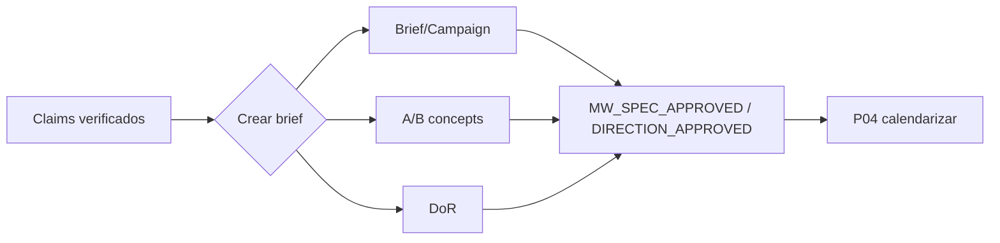

# Crea el brief o la campaña · P03

> Provenance: `MIA-MEDIA-LIB-2.0.0` v2.0.0-candidato · Estado: candidate · brief · campaña · A/B · audiencia [DOC]

## Outputs

- Brief o campaña definidos con funciones distintas
- Conceptos A/B listos para decisión
- Definition of Ready cumplido

## Deliverables

- `brief-campaign-map-v1`
- `ab-concepts-v1`
- `definition-of-ready-v1`

## Schematic



## ES — SPEC verbatim

```text
SITUACIÓN
Una oportunidad editorial ya tiene valor suficiente para diseñarse, pero todavía debe decidirse si será una pieza, un sistema de derivados, una serie o una campaña. El brief debe alinear intención, audiencia, contenido, ruta de producción y resultado sin entrar aún en fechas ni ejecución.

PEDIDO
Construye una de estas arquitecturas:
1. Pieza única.
2. Pieza matriz con derivados.
3. Miniserie de 2–4 piezas.
4. Campaña o colaboración.
Entrega un Brief o Campaign Map aprobable.

EJECUCIÓN
1. Resume base observada, inferencias, supuestos y datos pendientes.
2. Define:
   - audiencia situada y problema/deseo;
   - trabajo relacional prioritario;
   - promesa;
   - tesis o pregunta central;
   - punto de vista del creador;
   - evidencia y claims;
   - emoción y acción esperada;
   - límite de exposición.
3. Elige arquitectura y justifica por qué una opción más simple no sería suficiente.
4. Para cada pieza:
   - función;
   - tesis única;
   - formato;
   - ruta IA nativa, real asistida o híbrida;
   - activo de origen;
   - valor autónomo;
   - CTA;
   - relación con otras piezas;
   - riesgo y dependencia.
5. Diseña dos conceptos A/B con una sola variable: ángulo, narrador, grado de vulnerabilidad, hook conceptual o formato; fija constantes e hipótesis.
6. Define puente hacia siguiente contenido, comunidad, recurso, colaboración u oportunidad; selecciona uno.
7. Define señales de éxito por atención, resonancia, relación, inbound y esfuerzo.
8. En colaboración, añade obligaciones, aprobación, representación fiel y disclosure.
9. Cierra con recomendación, arquitectura, Brief, A/B, riesgos, pendientes y Definition of Ready.

LÍMITES Y CASOS BORDE
- Una pieza no debe cargar varias tesis.
- No crear campaña para llenar canales.
- No calendarizar ni producir todavía.
- No prometer resultados de plataforma.
- Claims, terceros, marcas y derechos no resueltos bloquean las partes afectadas.
- Una pieza derivada debe funcionar sola o recibir nuevo contexto.
- Si el esfuerzo supera la capacidad, reduce a pieza matriz y un derivado.

CRITERIO
PASS cuando:
- la audiencia y el trabajo relacional son concretos;
- cada pieza tiene función y tesis distintas;
- A/B cambia una sola variable;
- la ruta de producción está justificada;
- el CTA y el puente son coherentes;
- riesgos y dependencias son visibles;
- otra IA puede diseñar la pieza sin reinterpretar el objetivo.

DEFINITION OF DONE
Brief o Campaign Map versionado, concepto recomendado, A/B, mapa de piezas, medición, riesgos y aprobación pendiente.

FALLBACK
Si la oportunidad no soporta una campaña, crea una pieza única con un derivado; si la evidencia es insuficiente, regresa a investigación. interpreta, planifica, ejecuta.
```

## EN — SPEC verbatim

```text
SITUATION
An editorial opportunity already has enough value to be designed, but it still needs to be decided whether it will become a piece, a derivative system, a series, or a campaign. The brief must align intention, audience, content, production route, and outcome without yet entering dates or execution.

REQUEST
Build one of these architectures:
1. Single piece.
2. Master piece with derivatives.
3. Mini-series of 2–4 pieces.
4. Campaign or collaboration.
Deliver an approvable Brief or Campaign Map.

EXECUTION
1. Summarize the observed basis, inferences, assumptions, and pending data.
2. Define:
   - situated audience and problem/desire;
   - primary relational job;
   - promise;
   - central thesis or question;
   - creator’s point of view;
   - evidence and claims;
   - emotion and expected action;
   - exposure boundary.
3. Choose an architecture and explain why a simpler option would not be sufficient.
4. For each piece:
   - role;
   - single thesis;
   - format;
   - AI-native, assisted-real, or hybrid route;
   - source asset;
   - standalone value;
   - CTA;
   - relationship with other pieces;
   - risk and dependency.
5. Design two A/B concepts with one variable only: angle, narrator, degree of vulnerability, conceptual hook, or format; set constants and hypothesis.
6. Define one bridge to the next content, community, resource, collaboration, or opportunity.
7. Define success signals for attention, resonance, relationship, inbound, and effort.
8. For collaboration, add obligations, approval, faithful representation, and disclosure.
9. Close with recommendation, architecture, Brief, A/B, risks, pending items, and Definition of Ready.

LIMITS AND EDGE CASES
- A piece must not carry several theses.
- Do not create a campaign merely to fill channels.
- Do not schedule or produce yet.
- Do not promise platform results.
- Unresolved claims, third parties, brands, and rights block the affected parts.
- A derivative piece must work on its own or receive new context.
- If effort exceeds capacity, reduce to a master piece and one derivative.

CRITERIA
PASS when:
- the audience and relational job are concrete;
- each piece has a distinct role and thesis;
- A/B changes one variable;
- the production route is justified;
- the CTA and bridge are coherent;
- risks and dependencies are visible;
- another AI can design the piece without reinterpreting the goal.

DEFINITION OF DONE
Versioned Brief or Campaign Map, recommended concept, A/B, piece map, measurement, risks, and pending approval.

FALLBACK
If the opportunity does not support a campaign, create one piece with one derivative; if evidence is insufficient, return to research. interpret, plan, execute.
```

## PT — SPEC verbatim

```text
SITUAÇÃO
Uma oportunidade editorial já tem valor suficiente para ser desenhada, mas ainda é preciso decidir se será uma peça, um sistema de derivados, uma série ou uma campanha. O brief deve alinhar intenção, audiência, conteúdo, rota de produção e resultado sem entrar ainda em datas nem execução.

PEDIDO
Construa uma destas arquiteturas:
1. Peça única.
2. Peça-matriz com derivados.
3. Minissérie de 2–4 peças.
4. Campanha ou colaboração.
Entregue um Brief ou Campaign Map aprovável.

EXECUÇÃO
1. Resuma a base observada, inferências, suposições e dados pendentes.
2. Defina:
   - audiência situada e problema/desejo;
   - trabalho relacional prioritário;
   - promessa;
   - tese ou pergunta central;
   - ponto de vista do criador;
   - evidência e claims;
   - emoção e ação esperada;
   - limite de exposição.
3. Escolha a arquitetura e justifique por que uma opção mais simples não seria suficiente.
4. Para cada peça:
   - função;
   - tese única;
   - formato;
   - rota IA nativa, real assistida ou híbrida;
   - ativo de origem;
   - valor autônomo;
   - CTA;
   - relação com outras peças;
   - risco e dependência.
5. Desenhe dois conceitos A/B com uma única variável: ângulo, narrador, grau de vulnerabilidade, hook conceitual ou formato; fixe constantes e hipótese.
6. Defina uma ponte para o próximo conteúdo, comunidade, recurso, colaboração ou oportunidade; selecione apenas uma.
7. Defina sinais de sucesso para atenção, ressonância, relação, inbound e esforço.
8. Em colaboração, acrescente obrigações, aprovação, representação fiel e disclosure.
9. Encerre com recomendação, arquitetura, Brief, A/B, riscos, pendências e Definition of Ready.

LIMITES E CASOS LIMITE
- Uma peça não deve carregar várias teses.
- Não crie campanha para preencher canais.
- Não calendarize nem produza ainda.
- Não prometa resultados de plataforma.
- Claims, terceiros, marcas e direitos não resolvidos bloqueiam as partes afetadas.
- Uma peça derivada deve funcionar sozinha ou receber novo contexto.
- Se o esforço superar a capacidade, reduza para peça-matriz e um derivado.

CRITÉRIO
PASS quando:
- a audiência e o trabalho relacional são concretos;
- cada peça tem função e tese distintas;
- A/B muda uma única variável;
- a rota de produção está justificada;
- o CTA e a ponte são coerentes;
- riscos e dependências estão visíveis;
- outra IA pode desenhar a peça sem reinterpretar o objetivo.

DEFINITION OF DONE
Brief ou Campaign Map versionado, conceito recomendado, A/B, mapa de peças, medição, riscos e aprovação pendente.

FALLBACK
Se a oportunidade não sustentar uma campanha, crie uma peça única com um derivado; se a evidência for insuficiente, volte à pesquisa. interpreta, planeja, executa.
```

## Evidence tuple (O/I/A/R)

Base de evidencia

## Modelo recomendado

Modelo recomendado

## Criterios de aceptación

Criterios de aceptación

## No-regresión

Checklist de no regresión

## Definition of Done

Definition of Done
