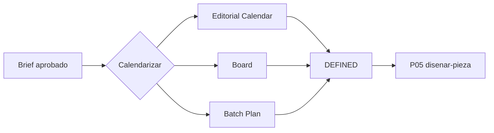

# Construye un calendario editorial realista · P04

> Provenance: `MIA-MEDIA-LIB-2.0.0` v2.0.0-candidato · Estado: candidate · calendario · capacidad · WIP · buffers [DOC]

## Outputs

- Calendario editorial realista con dependencias
- Tablero de capacidad por sprint
- Plan por lote medible antes de extender

## Deliverables

- `editorial-calendar-v1`
- `board-v1`
- `batch-plan-v1`

## Schematic



## ES — SPEC verbatim

```text
SITUACIÓN
Existen oportunidades o briefs, pero deben convertirse en una secuencia sostenible de trabajo. Un calendario de publicaciones sin tareas, dependencias y capacidad produce retrasos y sobrecarga.

PEDIDO
Selecciona una modalidad:
1. Sprint semanal.
2. Calendario de 30 días.
3. Calendario de campaña.
4. Sistema evergreen y reactivo.
Construye un calendario operativo que abarque creación y publicación.

EJECUCIÓN
1. Inventaría briefs, backlog, activos, campañas, plataformas y restricciones.
2. Prioriza mediante:
   - valor para audiencia;
   - trabajo relacional;
   - vigencia;
   - evidencia;
   - esfuerzo;
   - riesgo;
   - reutilización;
   - dependencia.
3. Fija capacidad: personas, bloques de trabajo, herramientas, aprobadores, WIP y buffers.
4. Para cada pieza registra:
   - ID, objetivo y formato;
   - ruta IA nativa, captura real o híbrida;
   - investigación;
   - diseño;
   - generación/captura;
   - revisión;
   - corrección;
   - edición;
   - aprobación;
   - empaque;
   - publicación;
   - comunidad;
   - aprendizaje;
   - responsable, estado, dependencia y fecha.
5. Agrupa tareas que comparten contexto o herramienta sin sacrificar personalización.
6. Mantén máximo dos piezas simultáneas como default y reserva capacidad para contingencias.
7. Define cadencia por capacidad y rol de plataforma, no por presión de volumen.
8. Incluye:
   - tablero;
   - calendario;
   - batch plan;
   - ventanas de aprobación;
   - buffers;
   - reglas de simplificar, posponer o cancelar;
   - criterio para contenido reactivo;
   - retrospectiva.
9. Si se requieren horarios, usa analíticas propias o diseña una ventana de prueba; no inventes optimización.

LÍMITES Y CASOS BORDE
- No programes un rodaje por defecto.
- No mezcles tarea y publicación como si fueran una sola fecha.
- Una pieza con blocker no entra en producción final.
- Contenido reactivo no desplaza compromisos sin criterio.
- Si la capacidad baja, reduce piezas o acabado antes de sacrificar derechos y claridad.
- No distribuir la misma pieza en todas las plataformas por obligación.
- Un calendario puede incluir días sin publicación.

CRITERIO
PASS cuando:
- toda publicación tiene trabajo previo, owner y aprobación;
- la carga cabe en la capacidad;
- WIP y buffers están visibles;
- cada plataforma tiene función;
- existen reglas de cambio;
- el calendario protege energía y aprendizaje;
- puede operarse sin reinterpretar estados.

DEFINITION OF DONE
Calendario, tablero, batch plan, dependencias, buffers, reglas operativas y próxima revisión.

FALLBACK
Si faltan briefs, crea un sprint mínimo con una pieza matriz y un derivado; si la capacidad es incierta, planifica la primera semana y mide antes de extender. interpreta, planifica, ejecuta.
```

## EN — SPEC verbatim

```text
SITUATION
Opportunities or briefs exist, but they must become a sustainable sequence of work. A publication calendar without tasks, dependencies, and capacity creates delays and overload.

REQUEST
Select one mode:
1. Weekly Sprint.
2. 30-Day Calendar.
3. Campaign Calendar.
4. Evergreen and Reactive System.
Build an operational calendar that covers creation and publishing.

EXECUTION
1. Inventory briefs, backlog, assets, campaigns, platforms, and constraints.
2. Prioritize through:
   - audience value;
   - relational job;
   - freshness;
   - evidence;
   - effort;
   - risk;
   - reuse;
   - dependency.
3. Set capacity: people, work blocks, tools, approvers, WIP, and buffers.
4. For each piece record:
   - ID, objective, and format;
   - AI-native, real-capture, or hybrid route;
   - research;
   - design;
   - generation/capture;
   - review;
   - correction;
   - editing;
   - approval;
   - packaging;
   - publishing;
   - community;
   - learning;
   - owner, state, dependency, and date.
5. Batch tasks that share context or tools without sacrificing personalization.
6. Keep no more than two simultaneous pieces as the default and reserve contingency capacity.
7. Set cadence by capacity and platform role, not volume pressure.
8. Include:
   - board;
   - calendar;
   - batch plan;
   - approval windows;
   - buffers;
   - rules to simplify, postpone, or cancel;
   - criteria for reactive content;
   - retrospective.
9. If timing recommendations are needed, use first-party analytics or design a testing window; do not invent optimization.

LIMITS AND EDGE CASES
- Do not schedule a shoot by default.
- Do not treat task date and publication date as the same thing.
- A piece with a blocker does not enter final production.
- Reactive content does not displace commitments without criteria.
- If capacity drops, reduce pieces or finish level before sacrificing rights and clarity.
- Do not distribute the same piece to every platform by obligation.
- A calendar may include days with no publication.

CRITERIA
PASS when:
- every publication has prior work, owner, and approval;
- the load fits capacity;
- WIP and buffers are visible;
- each platform has a role;
- change rules exist;
- the calendar protects energy and learning;
- it can be operated without reinterpreting states.

DEFINITION OF DONE
Calendar, board, batch plan, dependencies, buffers, operating rules, and next review.

FALLBACK
If briefs are missing, create a minimum sprint with one master piece and one derivative; if capacity is uncertain, plan the first week and measure before extending. interpret, plan, execute.
```

## PT — SPEC verbatim

```text
SITUAÇÃO
Existem oportunidades ou briefs, mas eles precisam se transformar em uma sequência sustentável de trabalho. Um calendário de publicações sem tarefas, dependências e capacidade gera atrasos e sobrecarga.

PEDIDO
Selecione uma modalidade:
1. Sprint semanal.
2. Calendário de 30 dias.
3. Calendário de campanha.
4. Sistema evergreen e reativo.
Construa um calendário operacional que abranja criação e publicação.

EXECUÇÃO
1. Inventarie briefs, backlog, ativos, campanhas, plataformas e restrições.
2. Priorize por:
   - valor para a audiência;
   - trabalho relacional;
   - atualidade;
   - evidência;
   - esforço;
   - risco;
   - reutilização;
   - dependência.
3. Defina capacidade: pessoas, blocos de trabalho, ferramentas, aprovadores, WIP e buffers.
4. Para cada peça registre:
   - ID, objetivo e formato;
   - rota IA nativa, captura real ou híbrida;
   - pesquisa;
   - design;
   - geração/captura;
   - revisão;
   - correção;
   - edição;
   - aprovação;
   - embalagem;
   - publicação;
   - comunidade;
   - aprendizado;
   - responsável, estado, dependência e data.
5. Agrupe tarefas que compartilham contexto ou ferramenta sem sacrificar personalização.
6. Mantenha no máximo duas peças simultâneas como padrão e reserve capacidade para contingências.
7. Defina cadência por capacidade e função de plataforma, não por pressão de volume.
8. Inclua:
   - quadro;
   - calendário;
   - plano de lotes;
   - janelas de aprovação;
   - buffers;
   - regras para simplificar, adiar ou cancelar;
   - critério para conteúdo reativo;
   - retrospectiva.
9. Se forem necessários horários, use analytics próprios ou desenhe uma janela de teste; não invente otimização.

LIMITES E CASOS LIMITE
- Não programe uma gravação por padrão.
- Não trate data da tarefa e data de publicação como a mesma coisa.
- Uma peça com blocker não entra em produção final.
- Conteúdo reativo não desloca compromissos sem critério.
- Se a capacidade cair, reduza peças ou acabamento antes de sacrificar direitos e clareza.
- Não distribua a mesma peça em todas as plataformas por obrigação.
- Um calendário pode incluir dias sem publicação.

CRITÉRIO
PASS quando:
- toda publicação tem trabalho prévio, owner e aprovação;
- a carga cabe na capacidade;
- WIP e buffers estão visíveis;
- cada plataforma tem uma função;
- existem regras de mudança;
- o calendário protege energia e aprendizado;
- pode ser operado sem reinterpretar estados.

DEFINITION OF DONE
Calendário, quadro, plano de lotes, dependências, buffers, regras operacionais e próxima revisão.

FALLBACK
Se faltarem briefs, crie um sprint mínimo com uma peça-matriz e um derivado; se a capacidade for incerta, planeje a primeira semana e meça antes de ampliar. interpreta, planeja, executa.
```

## Evidence tuple (O/I/A/R)

Base de evidencia

## Modelo recomendado

Modelo recomendado

## Criterios de aceptación

Criterios de aceptación

## No-regresión

Checklist de no regresión

## Definition of Done

Definition of Done
