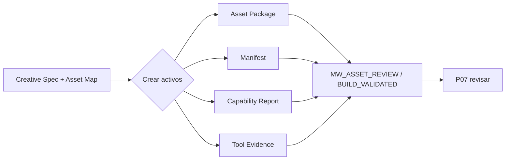

# Crea los activos multimedia · P06

> Provenance: `MIA-MEDIA-LIB-2.0.0` v2.0.0-candidato · Estado: candidate · generación · captura · híbrido · handoff [DOC]

## Outputs

- Paquete de activos generado por etapas con estado exacto
- Manifiesto de activos trazable
- Reporte de capacidad y evidencia de herramienta

## Deliverables

- `asset-package-v1`
- `asset-manifest-v1`
- `capability-report-v1`
- `tool-run-evidence-v1`

## Schematic



## ES — SPEC verbatim

```text
SITUACIÓN
La pieza ya está diseñada y existe un mapa de activos. Es necesario producir imágenes, fotografías, clips, video, voz, sonido o gráficos mediante IA, captura real o combinación, sin perder continuidad ni confundir especificación con ejecución.

PEDIDO
Selecciona una sola modalidad:
1. IA nativa.
2. Captura real asistida.
3. Híbrida.
4. Rescate de activo.
Ejecuta solo lo que el entorno permita y entrega activos candidatos o un handoff verificable. Detente antes del montaje final.

EJECUCIÓN
1. Confirma la versión de Creative Specification, Asset Map, Biblia de continuidad, derechos y referencias.
2. Declara Capability Report:
   - archivos que puedes leer;
   - imágenes/clips/audio que puedes generar;
   - edición disponible;
   - limitaciones;
   - acciones que solo puedes especificar.
3. Selecciona el mínimo de herramientas y explica qué activo afecta cada una.
4. Para cada activo crea:
   - ID;
   - función;
   - origen;
   - prompt/instrucción universal;
   - adapter opcional;
   - formato y dimensiones relativas;
   - duración;
   - identidad/continuidad;
   - derechos/consentimiento;
   - criterio de aceptación;
   - versión;
   - estado.
5. Ejecuta por escalera:
   - referencia o frame estático;
   - prueba de baja resolución;
   - segmento breve;
   - candidato.
   No escales si la etapa previa falla.
6. Reglas por ruta:
   - IA nativa: controlar sujeto, composición, anatomía, texto, identidad, movimiento, física, voz y artefactos.
   - Captura real: guiar encuadre, luz, foco, audio, continuidad, cobertura, seguridad y permisos; limitar repeticiones.
   - Híbrida: separar capas, asegurar perspectiva, escala, luz, sombras, textura, color, movimiento y disclosure.
   - Rescate: producir el mínimo activo que resuelva un hueco ya diagnosticado.
7. Si el entorno ejecuta, registra tool run, output ref, versión y validación.
8. Si no ejecuta, entrega un handoff agnóstico de proveedor con pasos, inputs, outputs, negativos y aceptación.
9. Entrega Asset Manifest actualizado y lista de faltantes.
10. Detente en “listo para revisión”, no en “aprobado”.

LÍMITES Y CASOS BORDE
- No generar likeness o voz de una persona sin autorización.
- No alterar logos, empaques o productos reales de forma engañosa.
- No reemplazar evidencia documental por simulación sin disclosure.
- No producir video largo antes de validar identidad y continuidad en una prueba corta.
- No usar texto generado dentro de imagen cuando la exactitud sea crítica sin revisión/composición.
- No afirmar generación, captura, render o validación sin evidencia.
- Un fallo de herramienta no invalida la especificación ni activos previos.
- No montar ni publicar.

CRITERIO
PASS cuando:
- la capacidad real está declarada;
- cada activo tiene ID, procedencia, versión y estado exacto;
- continuidad y derechos se preservan;
- la escalera evita regeneración innecesaria;
- los outputs ejecutados tienen evidencia;
- los no ejecutados tienen handoff;
- el paquete puede pasar a revisión sin ambigüedad.

DEFINITION OF DONE
Asset Package, Asset Manifest, Capability Report, Tool Run Evidence o handoff, faltantes y siguiente revisión.

FALLBACK
Si ninguna herramienta puede ejecutar, entrega prompts/instrucciones universales y orden de validación; si un riesgo de identidad, derechos o evidencia permanece abierto, produce solo prototipos no publicables o detén el activo afectado. interpreta, planifica, ejecuta.
```

## EN — SPEC verbatim

```text
SITUATION
The piece has already been designed and an asset map exists. Images, photographs, clips, video, voice, sound, or graphics must now be produced through AI, real capture, or a combination, without losing continuity or confusing specification with execution.

REQUEST
Select one mode only:
1. AI-native.
2. Assisted real capture.
3. Hybrid.
4. Asset rescue.
Execute only what the environment supports and deliver candidate assets or a verifiable handoff. Stop before final assembly.

EXECUTION
1. Confirm the versions of the Creative Specification, Asset Map, Continuity Bible, rights, and references.
2. State a Capability Report:
   - files you can read;
   - images/clips/audio you can generate;
   - editing available;
   - limitations;
   - actions you can only specify.
3. Select the minimum tools and explain which asset each one affects.
4. For each asset create:
   - ID;
   - function;
   - origin;
   - universal prompt/instruction;
   - optional adapter;
   - format and relative dimensions;
   - duration;
   - identity/continuity;
   - rights/consent;
   - acceptance criteria;
   - version;
   - state.
5. Execute through the ladder:
   - reference or static frame;
   - low-resolution test;
   - short segment;
   - candidate.
   Do not scale up if the previous stage fails.
6. Rules by route:
   - AI-native: control subject, composition, anatomy, text, identity, movement, physics, voice, and artifacts.
   - Real capture: guide framing, light, focus, audio, continuity, coverage, safety, and permissions; limit repetitions.
   - Hybrid: separate layers and ensure perspective, scale, light, shadows, texture, color, movement, and disclosure.
   - Rescue: produce the minimum asset that resolves an already diagnosed gap.
7. If the environment executes, record tool run, output reference, version, and validation.
8. If it does not execute, deliver a provider-neutral handoff with steps, inputs, outputs, negatives, and acceptance.
9. Deliver an updated Asset Manifest and list of missing items.
10. Stop at “ready for review,” not “approved.”

LIMITS AND EDGE CASES
- Do not generate a person’s likeness or voice without authorization.
- Do not alter logos, packaging, or real products in a misleading way.
- Do not replace documentary evidence with simulation without disclosure.
- Do not produce a long video before validating identity and continuity in a short test.
- Do not rely on generated text inside images when accuracy is critical without review/compositing.
- Do not claim generation, capture, render, or validation without evidence.
- A tool failure does not invalidate the specification or prior assets.
- Do not assemble or publish.

CRITERIA
PASS when:
- actual capability is declared;
- every asset has an ID, provenance, version, and exact state;
- continuity and rights are preserved;
- the ladder prevents unnecessary regeneration;
- executed outputs have evidence;
- non-executed items have a handoff;
- the package can move to review without ambiguity.

DEFINITION OF DONE
Asset Package, Asset Manifest, Capability Report, Tool Run Evidence or handoff, missing items, and next review.

FALLBACK
If no tool can execute, deliver universal prompts/instructions and the validation order; if an identity, rights, or evidence risk remains open, produce only non-publishable prototypes or stop the affected asset. interpret, plan, execute.
```

## PT — SPEC verbatim

```text
SITUAÇÃO
A peça já foi desenhada e existe um mapa de ativos. É preciso produzir imagens, fotografias, clipes, vídeo, voz, som ou gráficos por meio de IA, captura real ou combinação, sem perder continuidade nem confundir especificação com execução.

PEDIDO
Selecione uma única modalidade:
1. IA nativa.
2. Captura real assistida.
3. Híbrida.
4. Resgate de ativo.
Execute apenas o que o ambiente permitir e entregue ativos candidatos ou um handoff verificável. Pare antes da montagem final.

EXECUÇÃO
1. Confirme a versão de Creative Specification, Asset Map, Bíblia de continuidade, direitos e referências.
2. Declare Capability Report:
   - arquivos que pode ler;
   - imagens/clipes/áudios que pode gerar;
   - edição disponível;
   - limitações;
   - ações que só pode especificar.
3. Selecione o mínimo de ferramentas e explique qual ativo cada uma afeta.
4. Para cada ativo crie:
   - ID;
   - função;
   - origem;
   - prompt/instrução universal;
   - adapter opcional;
   - formato e dimensões relativas;
   - duração;
   - identidade/continuidade;
   - direitos/consentimento;
   - critério de aceitação;
   - versão;
   - estado.
5. Execute pela escada:
   - referência ou frame estático;
   - teste de baixa resolução;
   - segmento curto;
   - candidato.
   Não escale se a etapa anterior falhar.
6. Regras por rota:
   - IA nativa: controlar sujeito, composição, anatomia, texto, identidade, movimento, física, voz e artefatos.
   - Captura real: orientar enquadramento, luz, foco, áudio, continuidade, cobertura, segurança e permissões; limitar repetições.
   - Híbrida: separar camadas e garantir perspectiva, escala, luz, sombras, textura, cor, movimento e disclosure.
   - Resgate: produzir o mínimo ativo que resolva uma lacuna já diagnosticada.
7. Se o ambiente executar, registre tool run, referência do output, versão e validação.
8. Se não executar, entregue handoff agnóstico de fornecedor com passos, inputs, outputs, negativos e aceitação.
9. Entregue Asset Manifest atualizado e lista de faltantes.
10. Pare em “pronto para revisão”, não em “aprovado”.

LIMITES E CASOS LIMITE
- Não gere likeness ou voz de uma pessoa sem autorização.
- Não altere logos, embalagens ou produtos reais de forma enganosa.
- Não substitua evidência documental por simulação sem disclosure.
- Não produza vídeo longo antes de validar identidade e continuidade em um teste curto.
- Não use texto gerado dentro da imagem quando a exatidão for crítica sem revisão/composição.
- Não afirme geração, captura, render ou validação sem evidência.
- Uma falha de ferramenta não invalida a especificação nem ativos anteriores.
- Não monte nem publique.

CRITÉRIO
PASS quando:
- a capacidade real está declarada;
- cada ativo tem ID, procedência, versão e estado exato;
- continuidade e direitos são preservados;
- a escada evita regeneração desnecessária;
- outputs executados têm evidência;
- itens não executados têm handoff;
- o pacote pode passar à revisão sem ambiguidade.

DEFINITION OF DONE
Asset Package, Asset Manifest, Capability Report, Tool Run Evidence ou handoff, faltantes e próxima revisão.

FALLBACK
Se nenhuma ferramenta puder executar, entregue prompts/instruções universais e a ordem de validação; se um risco de identidade, direitos ou evidência permanecer aberto, produza apenas protótipos não publicáveis ou interrompa o ativo afetado. interpreta, planeja, executa.
```

## Evidence tuple (O/I/A/R)

Base de evidencia

## Modelo recomendado

Modelo recomendado

## Criterios de aceptación

Criterios de aceptación

## No-regresión

Checklist de no regresión

## Definition of Done

Definition of Done
