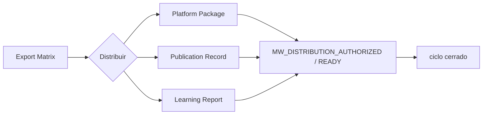

# Empaqueta, publica, conversa o aprende · P09

> Provenance: `MIA-MEDIA-LIB-2.0.0` v2.0.0-candidato · Estado: candidate · copy · plataformas · comunidad · analítica [DOC]

## Outputs

- Paquete por plataforma listo
- Registro de publicación trazable
- Reporte de aprendizaje cerrando el ciclo

## Deliverables

- `platform-package-v1`
- `publication-record-v1`
- `learning-report-v1`

## Schematic



## ES — SPEC verbatim

```text
SITUACIÓN
La pieza ha llegado a distribución o ya produjo interacciones y resultados. Empaquetar, publicar, conversar y aprender son trabajos distintos con diferentes riesgos y evidencias.

PEDIDO
Selecciona una sola modalidad:
1. Empaque.
2. Publicación.
3. Comunidad.
4. Aprendizaje.
No ejecutes las demás por implicación.

EJECUCIÓN

MODO EMPAQUE
1. Confirma máster, derivados, Brief, Brand OS, derechos, idioma, captions y portada.
2. Asigna a cada plataforma una decisión: publicar nativamente, adaptar, convertir, reservar u omitir.
3. Verifica en fuentes oficiales y con fecha cualquier spec, función o límite actual; sin navegación usa criterios evergreen y Dato requerido.
4. Para Instagram, TikTok, LinkedIn, YouTube, Facebook y X, cuando aplique, entrega:
   - función;
   - formato;
   - adaptación;
   - primer frame/hook;
   - título/portada;
   - copy;
   - CTA;
   - pregunta;
   - términos/hashtags solo si aportan;
   - captions y alt text;
   - disclosure;
   - comentario inicial;
   - puente;
   - checklist;
   - señal.
5. Diseña A/B de una sola variable y explica qué no podrá concluirse.

MODO PUBLICACIÓN
1. Exige:
   - archivo exacto;
   - artifact ID;
   - versión/hash;
   - plataforma/cuenta;
   - package aprobado;
   - autorización explícita;
   - herramienta real o checklist manual;
   - idempotency key.
2. Revalida derechos y disclosure.
3. Publica solo si existe capacidad; registra provider ID/URL.
4. Ante respuesta ambigua, consulta estado antes de reintentar.
5. No encadenes respuestas comunitarias.

MODO COMUNIDAD
1. Clasifica: reconocimiento, pregunta, objeción, colaboración, spam, riesgo o crisis.
2. Propón respuesta específica en voz del creador.
3. Sugiere profundizar, mover a privado, no responder o escalar.
4. Convierte preguntas útiles en Capture Cards.
5. Escala medicina, legal, derechos, amenazas, datos personales y crisis.

MODO APRENDIZAJE
1. Verifica integridad y comparabilidad de datos.
2. Evalúa:
   - atención;
   - resonancia;
   - relación;
   - comunidad;
   - inbound;
   - esfuerzo;
   - energía.
3. Distingue Observado, Inferido, Supuesto y Dato requerido.
4. Clasifica conclusión: inconclusa, direccional, repetida o incorporable.
5. Decide repetir, iterar, reutilizar, archivar o retirar.
6. Define una sola variable siguiente; un cambio de Brand OS requiere aprobación separada.

LÍMITES Y CASOS BORDE
- No publicar en todas las redes por obligación.
- No inventar horarios, tendencias, specs, resultados ni razones del algoritmo.
- Package no autoriza publicación.
- Silencio no equivale a aprobación.
- Una respuesta sensible no se automatiza.
- No comparar métricas de plataformas como equivalentes.
- Muestra pequeña no prueba causalidad.
- Música, marcas o permisos dudosos producen HOLD.
- Un error publicado activa corrección/retiro, no una defensa automática.

CRITERIO
PASS cuando:
- una sola modalidad fue ejecutada;
- cada plataforma usada tiene función;
- copy conserva voz;
- specs actuales están verificadas o marcadas;
- publicación tiene evidencia y aprobación exacta;
- comunidad mantiene criterio humano;
- aprendizaje incluye límites y sostenibilidad;
- existe siguiente acción.

DEFINITION OF DONE
Según el modo: Platform Package, Publication Record, Community Insight/Response Drafts o Learning Report/Next Experiment.

FALLBACK
Sin navegación, crea package evergreen; sin herramienta, checklist manual; sin aprobación, detente; sin datos, establece baseline cualitativo; ante riesgo, escala. interpreta, planifica, ejecuta.
```

## EN — SPEC verbatim

```text
SITUATION
The piece has reached distribution or has already produced interactions and results. Packaging, publishing, conversation, and learning are different jobs with different risks and evidence.

REQUEST
Select one mode only:
1. Packaging.
2. Publishing.
3. Community.
4. Learning.
Do not execute the others by implication.

EXECUTION

PACKAGING MODE
1. Confirm the master, derivatives, Brief, Brand OS, rights, language, captions, and cover.
2. Assign each platform one decision: publish natively, adapt, convert, reserve, or omit.
3. Verify any current specification, feature, or limit through official sources and record the date; without browsing, use evergreen criteria and Required data.
4. For Instagram, TikTok, LinkedIn, YouTube, Facebook, and X, when applicable, deliver:
   - role;
   - format;
   - adaptation;
   - first frame/hook;
   - title/cover;
   - copy;
   - CTA;
   - question;
   - terms/hashtags only when useful;
   - captions and alt text;
   - disclosure;
   - initial comment;
   - bridge;
   - checklist;
   - signal.
5. Design A/B around one variable only and explain what cannot be concluded.

PUBLISHING MODE
1. Require:
   - exact file;
   - artifact ID;
   - version/hash;
   - platform/account;
   - approved package;
   - explicit authorization;
   - real tool or manual checklist;
   - idempotency key.
2. Revalidate rights and disclosure.
3. Publish only if capability exists; record provider ID/URL.
4. If the provider response is ambiguous, check status before retrying.
5. Do not chain community responses.

COMMUNITY MODE
1. Classify: recognition, question, objection, collaboration, spam, risk, or crisis.
2. Propose a specific response in the creator’s voice.
3. Recommend deepening, moving to private, not responding, or escalating.
4. Turn useful questions into Capture Cards.
5. Escalate medical, legal, rights, threats, personal data, and crisis matters.

LEARNING MODE
1. Verify data integrity and comparability.
2. Evaluate:
   - attention;
   - resonance;
   - relationship;
   - community;
   - inbound;
   - effort;
   - energy.
3. Separate Observed, Inferred, Assumed, and Required data.
4. Classify the conclusion: inconclusive, directional, repeated, or ready to incorporate.
5. Decide repeat, iterate, reuse, archive, or withdraw.
6. Define one next variable only; a Brand OS change requires separate approval.

LIMITS AND EDGE CASES
- Do not publish to every network by obligation.
- Do not invent times, trends, specs, results, or reasons attributed to the algorithm.
- A package does not authorize publishing.
- Silence does not equal approval.
- A sensitive response is not automated.
- Do not compare platform metrics as equivalent.
- A small sample does not prove causality.
- Unclear music, brands, or permissions produce HOLD.
- A published error triggers correction/withdrawal, not an automatic defense.

CRITERIA
PASS when:
- one mode only was executed;
- every used platform has a role;
- copy preserves the creator’s voice;
- current specs are verified or marked;
- publishing has exact evidence and approval;
- community retains human judgment;
- learning includes limitations and sustainability;
- a next action exists.

DEFINITION OF DONE
According to the mode: Platform Package, Publication Record, Community Insight/Response Drafts, or Learning Report/Next Experiment.

FALLBACK
Without browsing, create an evergreen package; without a tool, use a manual checklist; without approval, stop; without data, establish a qualitative baseline; under risk, escalate. interpret, plan, execute.
```

## PT — SPEC verbatim

```text
SITUAÇÃO
A peça chegou à distribuição ou já produziu interações e resultados. Empacotar, publicar, conversar e aprender são trabalhos distintos, com riscos e evidências diferentes.

PEDIDO
Selecione uma única modalidade:
1. Empacotamento.
2. Publicação.
3. Comunidade.
4. Aprendizado.
Não execute as demais por implicação.

EXECUÇÃO

MODO EMPACOTAMENTO
1. Confirme máster, derivados, Brief, Brand OS, direitos, idioma, captions e capa.
2. Atribua a cada plataforma uma decisão: publicar nativamente, adaptar, converter, reservar ou omitir.
3. Verifique em fontes oficiais e com data qualquer especificação, função ou limite atual; sem navegação, use critérios evergreen e Dado requerido.
4. Para Instagram, TikTok, LinkedIn, YouTube, Facebook e X, quando aplicável, entregue:
   - função;
   - formato;
   - adaptação;
   - primeiro frame/hook;
   - título/capa;
   - copy;
   - CTA;
   - pergunta;
   - termos/hashtags apenas se agregarem;
   - captions e alt text;
   - disclosure;
   - comentário inicial;
   - ponte;
   - checklist;
   - sinal.
5. Desenhe A/B de uma única variável e explique o que não será possível concluir.

MODO PUBLICAÇÃO
1. Exija:
   - arquivo exato;
   - artifact ID;
   - versão/hash;
   - plataforma/conta;
   - package aprovado;
   - autorização explícita;
   - ferramenta real ou checklist manual;
   - idempotency key.
2. Revalide direitos e disclosure.
3. Publique apenas se houver capacidade; registre provider ID/URL.
4. Diante de resposta ambígua, consulte o estado antes de tentar novamente.
5. Não encadeie respostas comunitárias.

MODO COMUNIDADE
1. Classifique: reconhecimento, pergunta, objeção, colaboração, spam, risco ou crise.
2. Proponha resposta específica na voz do criador.
3. Sugira aprofundar, mover para privado, não responder ou escalar.
4. Converta perguntas úteis em Capture Cards.
5. Escale medicina, jurídico, direitos, ameaças, dados pessoais e crises.

MODO APRENDIZADO
1. Verifique integridade e comparabilidade dos dados.
2. Avalie:
   - atenção;
   - ressonância;
   - relação;
   - comunidade;
   - inbound;
   - esforço;
   - energia.
3. Separe Observado, Inferido, Suposição e Dado requerido.
4. Classifique a conclusão: inconclusiva, direcional, repetida ou incorporável.
5. Decida repetir, iterar, reutilizar, arquivar ou retirar.
6. Defina uma única variável seguinte; uma mudança de Brand OS exige aprovação separada.

LIMITES E CASOS LIMITE
- Não publique em todas as redes por obrigação.
- Não invente horários, tendências, specs, resultados nem razões do algoritmo.
- Package não autoriza publicação.
- Silêncio não equivale a aprovação.
- Uma resposta sensível não é automatizada.
- Não compare métricas de plataformas como equivalentes.
- Amostra pequena não comprova causalidade.
- Música, marcas ou permissões duvidosas geram HOLD.
- Um erro publicado ativa correção/retirada, não uma defesa automática.

CRITÉRIO
PASS quando:
- uma única modalidade foi executada;
- cada plataforma usada tem função;
- o copy preserva a voz;
- specs atuais estão verificadas ou marcadas;
- a publicação tem evidência e aprovação exatas;
- a comunidade mantém critério humano;
- o aprendizado inclui limites e sustentabilidade;
- existe uma próxima ação.

DEFINITION OF DONE
Conforme a modalidade: Platform Package, Publication Record, Community Insight/Response Drafts ou Learning Report/Next Experiment.

FALLBACK
Sem navegação, crie package evergreen; sem ferramenta, checklist manual; sem aprovação, pare; sem dados, estabeleça baseline qualitativo; diante de risco, escale. interpreta, planeja, executa.
```

## Evidence tuple (O/I/A/R)

Base de evidencia

## Modelo recomendado

Modelo recomendado

## Criterios de aceptación

Criterios de aceptación

## No-regresión

Checklist de no regresión

## Definition of Done

Definition of Done
