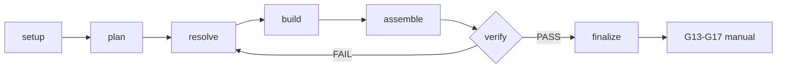

# Workflow Contract — Frames ContentOS Embedded Captions

Ground-truth rules. Orchestrator enforces; capabilities execute.

## Outputs

- Composición HTML+GSAP determinista (offline-first)
- Render final verificado (frames Playwright + FFmpeg)
- Audit PASS con gates step-gated cubiertas

## Deliverables

- `renders/final.mp4` (RENDERED_DRAFT)
- reporte de audit `workflow-audit.mjs` PASS
- design source resuelto (`frame.md` → `design.md` → `DESIGN.md`)

## Schematic

1. **Orchestrator, no rules.** This workflow orchestrates steps + gates. Design
   and motion rules live in capabilities. Do not duplicate.
2. **Footage untouched.** The base video ships intact — captions are the only
   addition. `graded_footage: true` = `graded-footage` violation (never
   grade/recolor/scanline/duotone/vignette the a-roll). Matte only lets subject
   occlude embed tracks; no covering/inpainting.
3. **Rail-first.** Rail carries most text; embed is the scarce, earned peak.
   `embed_all: true` or `rail_mode: none` = `embed-overuse` violation. ≤1 embed
   per beat, never two co-visible, ≥ a beat apart.
4. **Transcription-derived.** `content-os-media` produce un ASR candidato.
   `scriptMode: transcript_derived`, `captionPolicyRef`, `captionTrackRef` y
   `transcriptIntelligenceRef` son obligatorios. Solo `caption-track.json` de
   `content-os-transcript-intelligence` alimenta captions; `has_script: false`
   queda como legado no renderizable. `vo_mode: transcribed` conserva el audio.
5. **Step-gated.** Each step has a gate. No gate passed → no advance. Steps
   user-gated (0, 6) pause for approval. Step 1 prepare runs matte ∥ transcribe ∥
   audio-envelope (delegate `content-os-media`).
6. **Delegate capabilities on-demand.** Load only what the active step needs.
7. **Render-path offline-first.** Footage frames (FFmpeg) + caption frames
   (Playwright HTML→frames) + composite (FFmpeg) — all offline. Step 1
   transcription + matting: offline default, remote opt-in auth-gated (only
   network path). No network in render path (Steps 4-6).
8. **Deterministic.** Same footage + same caption plan + same frames → same
   render. No `Date.now()`/`Math.random()`/`new Date()` in compositions.
9. **Seek-safe.** GSAP `paused: true`, scrubbed to frame `t` (inherits
   `content-os-animation`). No `repeat: -1`, no relative `+=`, no CSS
   `transition:` on animated elements.
10. **RENDERED_DRAFT != HUMAN_APPROVED.** `renders/final.mp4` is `RENDERED_DRAFT`.
    `finalize` gate passed without render = `no-render` violation. `READY`/
    publication requires human gates G13-G17 (manual).

## Non-negotiables (inherits vendor)

- Face never 100% covered continuously — every 0.3s window, face bbox ≥30%
  uncovered.
- WCAG contrast — final render lints.
- Word timings match transcript within 80ms.
- Each caption ≥ 0.5s on screen.
- Captions stay on-frame (overflow gate).
- No two caption groups overlap in time AND screen region.

## Violation codes (audit)

| Code                  | Trigger                                                                        |
| --------------------- | ------------------------------------------------------------------------------ |
| `missing-gate`        | step with invalid state, unknown step, wrong route                             |
| `step-out-of-order`   | steps not in canonical order (setup→prepare→plan→design→build→verify→finalize) |
| `no-render`           | `finalize` gate-passed + `rendered: false`                                     |
| `network-in-workflow` | `https://` URL in state, or `offline: false`                                   |
| `graded-footage`      | `graded_footage: true` (never grade/recolor the footage)                       |
| `embed-overuse`       | `embed_all: true` or `rail_mode: none` (rail-first; embed scarce)              |

## Stop rules

- Workflow auditable (audit PASS), all gates passed, final.mp4 exists: STOP.
- Step user-gated without approval: STOP, request approval.
- Transcription garbage and no larger-model fallback viable: STOP, refuse (no
  fabricated captions).
- Matting unavailable and no fallback viable: STOP, mark `coverage_gap`.
- Source burned-in captions: STOP, refuse (decision gate).
- Material ambiguity or missing linguistic gate: STOP, refuse (`linguistic-gate`).
- No brief (router did not dispatch): STOP, route via `content-os-router`.
