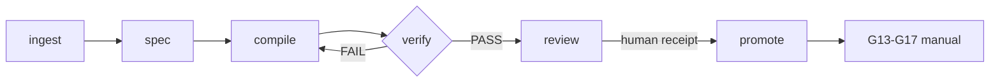

# Workflow Contract — Frames ContentOS General Video

Ground-truth rules. Orchestrator enforces; capabilities execute.

## Outputs

- Composición HTML+GSAP determinista (offline-first)
- Render final verificado (frames Playwright + FFmpeg)
- Audit PASS con gates step-gated cubiertas

## Deliverables

- `renders/final.mp4` (RENDERED_DRAFT)
- reporte de audit `workflow-audit.mjs` PASS
- design source resuelto (`frame.md` → `design.md` → `DESIGN.md`)

## Schematic v2

1. **Orchestrator, no rules.** This workflow orchestrates steps + gates. Design
   and motion rules live in capabilities. Do not duplicate.
2. **Scope exact.** Build what the user asked for. A title card is not a title
   card plus three scenes, music, and captions. Offer additions before adding.
   `scope_expanded: true` = `scope-creep` violation.
3. **Render-path offline-first.** Compositions (HTML+GSAP) + frames (Playwright
   HTML→frames) + composite (FFmpeg) — all offline. Media resolution: offline
   default, remote opt-in auth-gated (only network path). No network in render
   path (Steps 4-6).
4. **Deterministic.** Same brief + same plan + same frames → same render. No
   `Date.now()`/`Math.random()`/`new Date()` in compositions.
5. **Seek-safe.** GSAP `paused: true`, scrubbed to frame `t` (inherits
   `content-os-animation`). No `repeat: -1`, no relative `+=`, no CSS
   `transition:` on animated elements.
6. **Design before HTML.** Resolve design source in order: `frame.md` →
   `design.md` → `DESIGN.md`. First found = brand truth. Without a design spec,
   complete the 4 items (ground identity, concept angle sentence, font pairing,
   focal/edge/supporting/background) before writing composition HTML.
7. **Drafts before promotion.** Deterministic gates may produce `RENDERED_DRAFT`
   automatically. Human review remains mandatory before `HUMAN_APPROVED`, and
   this skill has no authority to grant `READY` or `PUBLISHED`.
8. **Step-gated.** Each step has a gate. No gate passed → no advance. Steps
   user-gated (0, 6) pause for approval.
9. **Delegate capabilities on-demand.** Load only what the active step needs.
10. **RENDERED_DRAFT != HUMAN_APPROVED.** A render remains `RENDERED_DRAFT`.
    `finalize` gate passed without render = `no-render` violation. `READY`/
    publication requires human gates G13-G17 (manual).

## Non-negotiables (inherits vendor)

- Build what was asked; offer additions before adding (scope exact).
- Design source resolved before HTML (`frame.md` → `design.md` → `DESIGN.md`).
- Timed elements use `class="clip"`; root + ancestors sized; one paused seek-safe
  timeline per composition on `window.__timelines`; deterministic.
- No render-time network fetches, clocks, or unseeded randomness.
- Borrowed workflows: borrow story shape + taste, not private scripts, pipeline
  state, or directory contracts.
- Companion flow: treatment delivered, not just scope — every scene's cited
  blueprint/rules realized, audio identity present (or silence chosen + said),
  open + close designed.

## Violation codes (audit)

| Code                  | Trigger                                                                          |
| --------------------- | -------------------------------------------------------------------------------- |
| `missing-gate`        | step with invalid state, unknown step, wrong route                               |
| `step-out-of-order`   | steps not in canonical order (setup→plan→resolve→build→assemble→verify→finalize) |
| `no-render`           | `finalize` gate-passed + `rendered: false`                                       |
| `network-in-workflow` | `https://` URL in state, or `offline: false`                                     |
| `scope-creep`         | `scope_expanded: true` (build what was asked, no creep)                          |
| `unapproved-render`   | `rendered_before_approval: true` (render only after Step 6 approval)             |

## Stop rules

- Workflow auditable (audit PASS), all gates passed, final.mp4 exists +
  verified: STOP.
- Step user-gated without approval: STOP, request approval.
- Intent not confirmed (router did not dispatch general-video): STOP, re-route
  via `content-os-router`.
- No brief: STOP, route via `content-os-router`.
- Brief fits a specialized workflow: STOP, hand off to the correct workflow.

## Spec First v2 invariants

- New compilations require `general-video-v2`; v1 is read-only for migration.
- Every derivative binds to `specSha256`. Drift in source, spec, script or asset
  invalidates only dependent pieces and layers.
- `piece-scripts-v2` requires semantic purpose, evidence `sourceSpans`, visual
  evidence, caption/correction references when speech is used, and a decision.
- A/B groups allow only `variantAxis: visual`; PCM, copy, CTA, timing,
  curtains, duration and frame count must match.
- Audio-only repair uses FFmpeg remux with `-c:v copy`; no video recode.
- `package` excludes network/private references and never grants publication.
- `scriptRef`, piece scripts, captions, correction ledger, assets, build manifest
  and review receipt are resolved inside the project and verified by SHA-256.
- FFmpeg accepts only relative file inputs under the project and runs with the
  protocol whitelist `file`; TCP, UDP, RTMP, RTSP, FTP, SRT and equivalents fail.
- Miniclip and A/B verdicts recalculate output, elementary video, decoded PCM,
  duration, frames, resolution, FPS and loudness; copy, timing, curtains and font
  files are independently rehashed before comparison.
