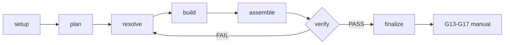

# Workflow Contract — Frames ContentOS Motion Graphics

Ground-truth rules. Orchestrator enforces; capabilities execute.

## Outputs

- Composición HTML+GSAP determinista (offline-first)
- Render final verificado (frames Playwright + FFmpeg)
- Audit PASS con gates step-gated cubiertas

## Deliverables

- `renders/final.mp4` (RENDERED_DRAFT)
- reporte de audit `workflow-audit.mjs` PASS
- design source resuelto (`frame.md` → `design.md` → `DESIGN.md`)

## Schematic

1. **Orchestrator, no rules.** This workflow orchestrates steps + gates. Design
   and motion rules live in capabilities. Do not duplicate.
2. **Unnarrated.** Motion-graphics has NO narration. `vo_mode: silent`, no
   SCRIPT.md, no TTS. `vo_mode` non-silent or `has_script: true` =
   `narration-in-motion-graphics` violation. Music bed optional background.
3. **Asset-first.** Decide asset strategy + source real material BEFORE
   designing the shot (Step 1 plan → Step 2 source). Form categories:
   `asset_needs: []`, skip Step 2. Search-driven: resolve via
   `content-os-media` (remote opt-in; degrade to asset-free if unavailable).
4. **Step-gated.** Each step has a gate. No gate passed → no advance. Steps
   user-gated (0, 6) pause for approval. Step 2 conditional (skip if
   `asset_needs` empty, state `gate-passed` with skipped note).
5. **Delegate capabilities on-demand.** Load only what the active step needs.
6. **Render-path offline-first.** Compositions offline/deterministic. Step 2
   source search is the only network path (search-driven, remote opt-in). No
   network in render path (Steps 4-6). State itself offline (no https URLs in
   state — `source_ref` normalized).
7. **Deterministic.** Same input + same design + same frames → same render. No
   `Date.now()`/`Math.random()`/`new Date()` in compositions (inherits core).
8. **Seek-safe.** GSAP `paused: true`, scrubbed to frame `t` (inherits
   `content-os-animation`). No `repeat: -1`, no relative `+=`, no CSS
   `transition:` on animated elements.
9. **No footage.** Motion-graphics has no live-action subject. `footage: true`
   = `footage-in-motion-graphics` violation. Assets (logos, images,
   screenshots) are assets, not footage.
10. **RENDERED_DRAFT != HUMAN_APPROVED.** `renders/video.mp4` (or overlay) is
    `RENDERED_DRAFT`. `finalize` gate passed without render = `no-render`
    violation. `READY`/publication requires human gates G13-G17 (manual).

## Violation codes (audit)

| Code                           | Trigger                                                                       |
| ------------------------------ | ----------------------------------------------------------------------------- |
| `missing-gate`                 | step with invalid state, unknown step, wrong route                            |
| `step-out-of-order`            | steps not in canonical order (setup→plan→source→design→build→verify→finalize) |
| `no-render`                    | `finalize` gate-passed + `rendered: false`                                    |
| `network-in-workflow`          | `https://` URL in state, or `offline: false`                                  |
| `narration-in-motion-graphics` | `vo_mode` not `silent`, or `has_script: true`                                 |
| `footage-in-motion-graphics`   | `footage: true` (no live-action subject)                                      |

## Stop rules

- Workflow auditable (audit PASS), all gates passed, MP4/overlay exists: STOP.
- Step user-gated without approval: STOP, request approval.
- Asset search unavailable and no asset-free fallback viable: STOP, mark
  `coverage_gap` or degrade to asset-free (form category).
- No brief (router did not dispatch): STOP, route via `content-os-router`.
