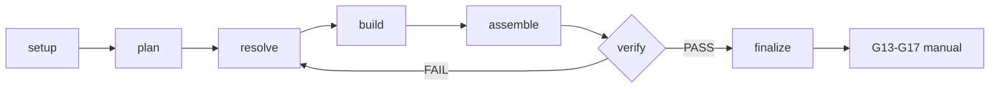

# Workflow contract — PR to video

8 reglas que gobiernan el workflow. Source of truth para
`scripts/workflow-audit.mjs` y `scripts/check-skill.mjs`.

## Outputs

- Composición HTML+GSAP determinista (offline-first)
- Render final verificado (frames Playwright + FFmpeg)
- Audit PASS con gates step-gated cubiertas

## Deliverables

- `renders/final.mp4` (RENDERED_DRAFT)
- reporte de audit `workflow-audit.mjs` PASS
- design source resuelto (`frame.md` → `design.md` → `DESIGN.md`)

## Schematic



## Reglas

1. **Hash-bound.** Workflow state auditable (`workflow-audit.mjs` PASS). Sin
   gate pasado o step fuera de orden, no avanzas. Fails closed.
2. **Orchestrator, no rules.** Este workflow orquesta steps + gates. Design y
   motion rules viven en Fase 2 capabilities. No dupliques.
3. **Code change input, no capture.** Input es un PR (cambio de código) leído via
   `gh` en Step 1. No website capture, no footage, no asset inventory. Únicos real
   assets: contributor avatars (`assets/<login>.png`, best-effort) para credits
   close. `footage=true` en state = violación.
4. **Step-gated.** 8 steps en orden (setup → ingest → design → storyboard → audio
   → visual-design → build-frames → finalize). Cada step tiene gate. Steps
   user-gated (setup, storyboard, finalize) pausan para approval.
5. **Delega capabilities on-demand.** Carga solo lo que el step activo necesita.
   Capabilities nunca son owners del deliverable; el workflow sí.
6. **Render-path offline-first.** Compositions (frames) offline/deterministic.
   Step 1 ingest usa `gh` (único network step, read-only, deterministic dado un
   PR ref). TTS/audio via `content-os-media` offline cascade default. Remoto
   opt-in auth-gated, fail-closed sin creds. No network en render path (Step
   5-6). State mismo es offline (no https URLs en state).
7. **Deterministic.** Mismo PR ref + mismo design + mismo frame → mismo render.
   Sin `Date.now()`/`Math.random()`/`new Date()`/`performance.now()`/`fetch`/
   `setTimeout`/`setInterval` en compositions (hereda core). Seek-safe: GSAP
   `paused: true`, scrubbed, no `repeat: -1`/relative `+=`/CSS `transition:`.
8. **RENDERED_DRAFT.** `renders/video.mp4` es `RENDERED_DRAFT`. `finalize` gate
   passed sin render = `no-render` violación. `READY`/publicación requiere
   gates humanos G13-G17 (manuales por diseño). Style siempre `code-editorial`
   (fijo en Step 2, nunca preguntado); `style` != `code-editorial` =
   `style-not-code-editorial` violación.

## Example state entry

```json
{
  "schemaVersion": "pr-to-video-v1",
  "projectId": "acme-sdk-pr-1842",
  "route": "content-os-pr-to-video",
  "capability_map": [
    "content-os-core",
    "content-os-animation",
    "content-os-keyframes",
    "content-os-creative",
    "content-os-media",
    "content-os-registry"
  ],
  "source_type": "github-pr",
  "pr_ref": "acme/sdk#1842",
  "style": "code-editorial",
  "duration_s": 75,
  "vo_mode": "restructured",
  "offline": true,
  "silent": false,
  "rendered": false,
  "steps": [
    {"step": "setup", "state": "gate-passed"},
    {"step": "ingest", "state": "gate-passed"},
    {"step": "design", "state": "gate-passed"},
    {"step": "storyboard", "state": "user-approved"},
    {"step": "audio", "state": "gate-passed"},
    {"step": "visual-design", "state": "gate-passed"},
    {"step": "build-frames", "state": "gate-passed"},
    {"step": "finalize", "state": "pending"}
  ]
}
```

## Failure modes

| Code                       | Trigger                                   | Fix                                  |
| -------------------------- | ----------------------------------------- | ------------------------------------ |
| `missing-gate`             | step sin gate pasado o route inválida     | Pasar gate antes de avanzar          |
| `step-out-of-order`        | step fuera de orden o desconocido         | Reordenar, correr steps en secuencia |
| `footage-in-pr-video`      | `footage=true` en pr-to-video workflow    | Quitar footage, code-editorial input |
| `style-not-code-editorial` | `style` ausente o != `code-editorial`     | Fijar style: code-editorial (always) |
| `no-render`                | finalize gate passed sin `rendered: true` | Render MP4 antes de cerrar finalize  |
| `network-in-workflow`      | URL https en state o `offline` not true   | Quitar URL del state, normalizar ref |

## Stop rules

- Workflow auditable PASS, todos gates pasados, MP4 existe: STOP workflow.
- Step user-gated sin approval: STOP, pedir approval.
- `gh` falla (auth/not-found/private): STOP, reportar stderr, no fabricar PR.
- TTS no disponible y no silent marker: STOP, `coverage_gap` o silent.
- Sin brief: STOP, rutcea via `content-os-router`.
