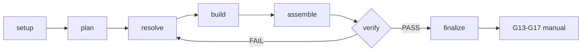

# Workflow contract — content-os-remotion-bridge

The bridge is an orchestrator. It carries no rules of its own beyond this
workflow contract. It translates existing compositions between the two Content
OS paradigms (Remotion ↔ HTML+GSAP) and enforces the determinism contract of
the target paradigm.

## Outputs

- Composición traducida entre Remotion ↔ HTML+GSAP
- Contrato de determinismo del paradigma destino enforced
- Audit PASS (`workflow-audit.mjs`)

## Deliverables

- composición destino (HTML+GSAP o Remotion)
- mapeo tween/pose/media trazable
- reporte de audit PASS

## Schematic

## Rules

1. **Orchestrator, no rules of its own.** The bridge delegates composition structure to `content-os-core`, tween mapping to `content-os-animation`, pose/determinism to `content-os-keyframes`, block reuse to `content-os-registry`, media element mapping to `content-os-media`. It does not author creative (`content-os-creative` is out of scope).

2. **Bidirectional, explicit direction.** Direction (R→H or H→R) is confirmed at setup. The skill does not infer direction from source content; it asks if ambiguous.

3. **Lint before translate.** The source lint runs in step 2. If any blocker fires, translation is refused — escape-hatch to the runtime interop pattern. Translating past a blocker is the `unapproved-interop` violation.

4. **Step-gated.** Steps run in canonical order: setup → lint → plan → translate → validate → finalize. Each step gates the next. A step out of order is the `step-out-of-order` violation; a step run without its gate precondition is the `missing-gate` violation.

5. **Render-path offline-first.** Compositions + frames + composite are all offline. Remote media is opt-in auth-gated via `content-os-media` and never in the render path without credentials. Network in the render path is the `network-in-workflow` violation.

6. **Deterministic + seek-safe.** R→H output follows the HTML+GSAP contract (`window.__timelines`, `paused: true`, `tl.seek(frame/fps)`, no forbidden API). H→R output follows the Remotion contract (`useCurrentFrame()`-driven, `interpolate`/`spring`, no state-driven animation, `Config.setVideoImageFormat("png")` + `Config.setColorSpace("bt709")` for eval parity).

7. **SSIM-graded eval, no silent divergence.** Step 5 validates the translation by rendering both source and target and SSIM-diffing them. Threshold: ~0.02 below the source's complexity tier baseline. Skipping the eval or proceeding below threshold is the `silent-divergence` violation — a translation that "looks right" but renders wrong is silently wrong.

8. **Translate what was asked.** Scope exact: translate this source, nothing more. No creative re-authoring, no scope expansion. Gaps are documented in `TRANSLATION_NOTES.md`, not silently filled.

9. **Document gaps.** Step 6 writes `TRANSLATION_NOTES.md` next to the target output: every gap that didn't translate cleanly (volume ramps dropped, custom presentations approximated, fonts substituted, deployment config dropped, third-party UI declined).

10. **RENDERED_DRAFT.** The output is `RENDERED_DRAFT` — never `READY`/`HUMAN_APPROVED`/`PUBLISHED` without the human gates (G15 H01, G17 publish). A passing eval does not grant `READY`.

## Non-negotiables

- Direction confirmed at setup; the skill does not guess.
- Lint runs before translate; blockers escape-hatch, they do not translate.
- Target composition conforms to the target paradigm's determinism contract exactly.
- No render-time network in either direction.
- Eval runs before finalize; below threshold blocks finalize.
- `TRANSLATION_NOTES.md` written for every gap.
- Both renders use matching pixel format for the SSIM diff.

## Violation codes

| Code                  | Trigger                                                                                                                      |
| --------------------- | ---------------------------------------------------------------------------------------------------------------------------- |
| `missing-gate`        | a step ran without its gate precondition, or an unknown step/state appeared                                                  |
| `step-out-of-order`   | steps not in canonical order (setup → lint → plan → translate → validate → finalize)                                         |
| `no-translation`      | finalize gate-passed but no target composition emitted (`translated === false`)                                              |
| `network-in-workflow` | `offline !== true` or an `https://` URL in the workflow state (render path not offline)                                      |
| `unapproved-interop`  | blocker detected (`has_blocker === true`) but translation attempted (`translate_attempted === true`) instead of escape-hatch |
| `silent-divergence`   | finalize gate-passed but validation not passed (`validation_passed === false`) — SSIM eval skipped or below threshold        |

## Stop rules

- **Stop** if the source is not a composition in either Frames ContentOS paradigm. Recommend `content-os-general-video` for a fresh native build.
- **Stop** if the source lint fires any blocker. Recommend the runtime interop pattern.
- **Stop** if the SSIM diff fails (below threshold). Re-read the relevant mapping ref, re-translate, re-validate.
- **Stop** if provenance/rights/authority are unverified. No promotion without hashes/provenance (AGENTS.md).
- **Stop** if the write-set is unclear. No editing outside the declared write-set.
- **Stop** if a secret/PII/private locator appears. Escalate.
