# Red de Contenido Instagram V2

Estado: `active_candidate`. Autoridad: contrato operativo versionado. [CONFIG]

Este documento define la red permanente para producir contenido de Instagram con una sola identidad
visible, fuentes trazables, adaptación de marca explícita y gates que separan producción, validación,
aprobación humana y publicación. No eleva ningún artefacto a `READY` o `PUBLISHED`. [DOC]

## 1. Decisión operativa

La V2 usa un orquestador, especialistas efímeros reales y un Guardian independiente. “Dos agentes”
significa un máximo de dos instancias especialistas concurrentes, no un límite de dos agentes
totales en la red. [CONFIG]

1. `RT-01 CreativeOrchestratorV2` produce el plan, instancia especialistas y consolida el candidato.
   [CONFIG]
2. `RT-02…RT-10` son agentes especializados efímeros reales. Cada instancia recibe una tarea acotada,
   registra su ID runtime, contrato de rol y hashes de entrada/salida, y termina después del handoff.
   [CONFIG]
3. Como máximo operan dos instancias especialistas concurrentes. El comité material de cinco
   especialistas se ejecuta por olas `2 + 2 + 1`, preservando deliberación y trazabilidad. [CONFIG]
4. Un verificador determinista distinto del producer ejecuta schemas, hashes, derechos, marca,
   accesibilidad y tests. [CONFIG]
5. `RT-11 GuardianV2` revisa en modo read-only y no remedia el candidato que evalúa. [CONFIG]
6. `H01` conserva la aprobación humana `G15`. Ningún agente, script o adapter puede simularla. [CONFIG]

## 2. Topología

```mermaid
flowchart LR
  I["Intake"] --> S["Fuentes y claims"]
  S --> O["RT-01 · CreativeOrchestratorV2"]
  O --> C["RT-02…RT-10 · especialistas efímeros"]
  C --> W["Máximo 2 concurrentes · comité 2 + 2 + 1"]
  W --> B["Brand adaptation"]
  B --> P["Plugin por tipo"]
  P --> R["Renderer determinista"]
  R --> V["Verifier distinto"]
  V --> G["RT-11 · GuardianV2 read-only"]
  G --> H["G15 · H01"]
  H --> RD["G16 · READY"]
  RD --> PB["G17 · PUBLISHED"]
```



NotebookLM permanece read-only y n8n permanece dry-run/propose-only hasta una autorización separada.
[CONFIG]

## 3. Interfaces canónicas

| Interfaz              | Ruta                                                     | Responsabilidad                           |
| --------------------- | -------------------------------------------------------- | ----------------------------------------- |
| Contrato de contenido | `core/contracts/content-v2.ts`                           | Work order, plan, paquete y estados       |
| Orquestador           | `workflows/core/orchestrate-content-v2.ts`               | Routing, límites y handoffs               |
| Matriz                | `registries/content-types/instagram-workflow-matrix.yml` | Ocho workflows y su madurez               |
| Marca                 | `registries/brand/brand-profile-v2.yml`                  | Identidad, tokens, fuentes y reglas       |
| Voz                   | `registries/brand/voice-profile-v2.yml`                  | Minto, pilares, evidencia, red list y CTA |
| Canal                 | `registries/channels/instagram-profile-v1.yml`           | Tono, perfiles internos y accesibilidad   |
| Adaptación            | `registries/brand/brand-adaptation-decision-v1.yml`      | Qué se preserva, adapta y prohíbe         |
| Tokens authored       | `brand/tokens/brand-tokens.yml`                          | Única fuente editable de tokens           |
| Fuentes offline       | `brand/fonts/font-manifest.yml`                          | Binarios, licencias, hashes y procedencia |

El ChannelProfile liga cuatro fuentes oficiales del Help Center a `observed_at` y aplica
`stale_after_days: 30`. Al vencer, permite pruebas locales pero limita el resultado a
`RENDERED_DRAFT` y bloquea `READY` y publicación hasta reobservar esas fuentes. Los perfiles de
tamaño son decisiones internas del proyecto: no se presentan como máximos oficiales o universales.
[CONFIG]

## 4. Pipeline compartido

Todo workflow aplica diez etapas en el mismo orden:

1. `intake`: objetivo, audiencia, tipo, idioma y límites.
2. `source_grounding`: snapshot de fuentes, claims y cobertura.
3. `strategic_brief`: resultado, pilar y criterio de éxito.
4. `narrative_and_copy`: Minto, soportes MECE, evidencia y CTA.
5. `brand_adaptation`: snapshot de marca, voz y canal.
6. `production`: plugin tipado por tipo de contenido.
7. `deterministic_validation`: schemas, hashes, overflow, derechos y privacidad.
8. `independent_verification`: verificador distinto del producer.
9. `guardian`: veredicto read-only y gaps.
10. `human_gate`: `H01` decide en `G15`.

Un fallo de fuente, derechos, schema, privacidad o autoridad detiene el pipeline. No se sustituye una
fuente, tipografía o claim en silencio. [CONFIG]

## 5. Matriz de ocho workflows

| ID                     | Tipo             | Estado             | Perfil            | Estado automático máximo |
| ---------------------- | ---------------- | ------------------ | ----------------- | ------------------------ |
| `IG-CAROUSEL-V1`       | `carousel`       | `active_candidate` | `portrait_static` | `RENDERED_DRAFT`         |
| `IG-FEED-TEXT-V1`      | `feed-text`      | `planned`          | `portrait_static` | `DRAFT`                  |
| `IG-FEED-PHOTO-V1`     | `feed-photo`     | `planned`          | `portrait_static` | `DRAFT`                  |
| `IG-INFOGRAPHIC-V1`    | `infographic`    | `planned`          | `portrait_static` | `DRAFT`                  |
| `IG-STORY-SEQUENCE-V1` | `story-sequence` | `planned`          | `vertical_motion` | `DRAFT`                  |
| `IG-REEL-MOTION-V1`    | `reel-motion`    | `planned`          | `vertical_motion` | `DRAFT`                  |
| `IG-MICROCOPY-V1`      | `microcopy`      | `planned`          | `portrait_static` | `DRAFT`                  |
| `IG-LIVE-KIT-V1`       | `live-kit`       | `planned`          | `vertical_motion` | `DRAFT`                  |

Solo carrusel tiene implementación candidata. `planned` significa contrato inventariado, no
capacidad ejecutable. [CONFIG]

## 6. Workflow activo candidato: carrusel

### 6.1 Contrato

- Entre 3 y 10 tarjetas; el piloto usa exactamente 8. [CONFIG]
- Perfil interno `portrait_static`: 1080 × 1350. [CONFIG]
- Cada slide declara propósito, titular, cuerpo, dirección visual, alt text, fuente y claim. [CONFIG]
- Caption y CTA son parte del paquete, no texto huérfano. [CONFIG]
- La fuente y el snapshot de marca quedan ligados por SHA-256. [CONFIG]

### 6.2 Implementación

| Pieza        | Ruta                                                 |
| ------------ | ---------------------------------------------------- |
| Plugin       | `workflows/content/types/carousel/plugin.ts`         |
| Manifest     | `workflows/content/types/carousel/manifest.yml`      |
| Schema       | `workflows/content/types/carousel/schema.ts`         |
| Renderer     | `renderers/static-social/scripts/render-carousel.ts` |
| Build        | `pnpm carousel:build`                                |
| Verificación | `pnpm verify:carousel`                               |

El renderer usa activos locales, no hace requests remotos y emite PNG, HTML offline, contact sheet,
manifest y hashes. La ausencia de tipografía oficial produce `RIGHTS_GAP`; no activa un fallback.
[CONFIG]

### 6.3 Gates de carrusel

1. `CAR_SOURCE_GROUNDED`: fuentes y claims resolubles.
2. `CAR_CONTENT_VALID`: slide count, Minto, CTA y alt text válidos.
3. `CAR_BRAND_VALID`: BrandProfile, VoiceProfile y ChannelProfile resueltos.
4. `CAR_RENDER_VALID`: tamaño, overflow, safe zones, contraste y determinismo.
5. `CAR_VERIFIED`: verificador distinto acepta la evidencia.
6. `G14`: Guardian emite veredicto.
7. `G15`: H01 aprueba o devuelve.
8. `G16`: readiness explícito.
9. `G17`: publicación explícita y separada.

`CAR_RENDER_VALID`, `RENDERED_DRAFT`, `FINAL`, `HUMAN_APPROVED`, `READY` y `PUBLISHED` no son
sinónimos. [CONFIG]

## 7. Marca permanente

`BrandProfileV2` está `BRAND_VALIDATED` para producción local de candidatos porque:

- las fuentes estables están ligadas a commit y SHA-256;
- los tres archivos dirty solo informan drift y no sustituyen autoridad limpia;
- existe una sola fuente authored de tokens y tres proyecciones verificables;
- Poppins y Montserrat se incluyen localmente con licencia OFL, URL raw fijada y hash;
- el contraste mínimo y la regla navy sobre gold son contractuales.

`BRAND_VALIDATED` no implica validación de voz, Guardian, H01, readiness o publicación. [CONFIG]

## 8. Voz y tono

La voz permanece constante: método, evidencia honesta, utilidad decisoria y tecnología como aliada.
El tono de Instagram adapta formalidad, energía y profundidad sin alterar esa identidad. [CONFIG]

El default es Minto Completo: conclusión, tres soportes MECE, evidencia por soporte y un CTA. Minto
Micro se admite solo por atención restringida o ritmo corto: conclusión, dos soportes, evidencia y
CTA. [CONFIG]

Cada soporte se ancla a uno de tres pilares: `(R)Evolución`, `Intención antes que intensidad` o
`Tecnología como aliada`. Una afirmación fuerte requiere dato real, indicador sugerido, señal a medir
o dato requerido. El CTA contiene verbo, objeto y contexto. [CONFIG]

La fuente de voz permanece `first_party_candidate`; por ello `VoiceProfileV2` está
`VOICE_CANDIDATE` con confianza `medium`. Requiere confirmación independiente del owner antes de
respaldar release público. [CONFIG]

## 9. Tokens y tipografías

`brand/tokens/brand-tokens.yml` es la única fuente editable. Las proyecciones JSON, CSS y TypeScript
son derivadas y deben coincidir byte a byte con el generador del validator. Ningún contrato V2 fuera
de la fuente y sus proyecciones puede contener colores literales. [CONFIG]

Los aliases CSS del renderer son `--brand-navy`, `--brand-white`, `--brand-white-soft` y
`--brand-white-muted`; todos resuelven a tokens authored. Los headings usan Poppins y el cuerpo
Montserrat. El render permanece offline. [CONFIG]

## 10. Estados y gate humano

```text
DRAFT
  → SOURCE_GROUNDED
  → BRAND_ADAPTED
  → RENDERED_DRAFT
  → TECHNICALLY_VALIDATED
  → GUARDIAN_VERIFIED
  → HUMAN_APPROVED
  → READY
  → PUBLISHED
```

Los primeros cinco estados pueden ser producidos por máquina. `GUARDIAN_VERIFIED` requiere identidad
independiente. `HUMAN_APPROVED` requiere H01 en G15. `READY` y `PUBLISHED` requieren G16 y G17,
respectivamente. [CONFIG]

## 11. Presupuesto 10x sin expansión superior a 2x

Baseline: commit `cf887ca`, 377 archivos, 119.268 palabras y 40.566 LOC físicas. El corpus authored
elegible —texto versionable sin historia inmutable ni proyecciones generadas— contiene 78.040
palabras y 29.426 LOC. [CÓDIGO]

Límites:

- máximo 754 archivos versionables;
- cada Markdown editable del baseline conserva un máximo de 2× sus palabras originales;
- el corpus authored elegible final conserva un máximo de 1.5× las palabras del baseline elegible;
- cada binding generated/template aplicable conserva un máximo de 2× palabras y LOC;
- el corpus authored total conserva un hard cap de 2× palabras y 2× LOC;
- la historia queda excluida de esos presupuestos y permanece byte-idéntica;
- agregar un nuevo tipo no modifica el core ni el orquestador;
- un tipo nuevo aporta un plugin, schema/manifest, renderer si aplica y tests;
- toda evidencia histórica del baseline permanece byte-idéntica.

“10x” significa capacidad de registrar diez tipos sin duplicar el pipeline, no diez implementaciones
falsamente declaradas como listas. Las métricas finales reales y su ratio se regeneran en
`docs/program/file-disposition-ledger.md`; `verify:docs` falla si cualquiera de estos límites deriva.
[CONFIG]

## 12. Disposición de archivos

`docs/program/file-disposition-ledger.yml` clasifica los 377 archivos del baseline y asigna owner,
hash inicial, palabras, LOC, decisión, justificación y evidencia actual. Las únicas disposiciones
son:

- `refactored`;
- `generator_fixed`;
- `superseded`;
- `verified_no_change`;
- `quarantined`;
- `immutable_history`.

El ledger no llama refactor a bytes sin cambio, exige un sucesor real para `superseded`, mantiene el
wrapper Stitch en `quarantined` y rechaza faltantes, owner sin resolver, drift o mutación de
`immutable_history`. [CONFIG]

## 13. Privacidad y procedencia

- Los artefactos durables usan `source_repo_id` y rutas relativas. [CONFIG]
- No se persisten locators locales, tokens, cookies, PII ni chain-of-thought. [CONFIG]
- Los hashes expresan identidad de bytes, no autorización de publicación. [CONFIG]
- Cada aporte especializado registra ID de instancia, contrato de rol e input/output hash. [CONFIG]
- n8n y cualquier conector de publicación permanecen desactivados. [CONFIG]

## 14. Criterio de done V2

La capa documental y de marca queda completa cuando:

1. `check-docs`, `check-brand` y `check-content-matrix` pasan.
2. Los tests contractuales y negativos cubren `BR`, `VOICE`, `SOC` y `CAR`.
3. Las fuentes locales verifican contra el manifest y OFL.
4. Las proyecciones de tokens no presentan drift.
5. El ledger cubre 387/387, valida los cuatro presupuestos y conserva 95/95 históricos por SHA-256.
6. El carrusel produce un candidate reproducible sin elevar gates.
7. Guardian y H01 permanecen pendientes hasta evidencia independiente.

## 15. Coverage gaps

- `VOICE_CANDIDATE`: confirmación independiente del owner pendiente.
- Especificaciones live de Instagram pendientes antes de publicación.
- Guardian V2 y H01 pendientes.
- Los siete workflows `planned` no tienen implementación.
- Los adapters de publicación permanecen desactivados.

Estos gaps no bloquean el diseño o render local del carrusel; sí bloquean `READY` y `PUBLISHED`.
[CONFIG]
